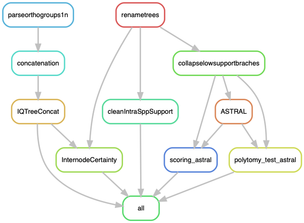

# Phylogeny: Making a big phylogeny of the *Podospora* complex

A pipeline to get a phylogeny of the *Podospora* complex. It relies on the output of the pipeline `OrthoTrees.smk`. Specifically, it requites:

- The path to all the alignments of the orthogroups
- The path to the corresponding IQTree trees of each orthogroup all collected in a single file `SingleGeneTrees.tre` (this is the ASTRAL input)
- The output of OrthoFinder `Orthogroups.csv`
- `Podan2_1n.clean.txt` -- The name of the Podan2 genes for each orthogroup, in the format Pa_X_XXXX, where X is the chromosome and XXXX is the gene code.

It also requires a species mapping file in the style of ASTRAL, provided in `data/spp_mapping.txt`.

## Building the environment

First, I can start by updating conda.

    $ conda update -n base conda

Now, to create the environment.

    $ conda create -n LorePhylogenetics -c bioconda

**IMPORTANT!!** activate the environment before installing stuff! 
    
    $ conda activate LorePhylogenetics
    $ conda install -c bioconda snakemake-minimal=5.4.4
    $ conda install -c bioconda biopython=1.72=py37h04863e7_0
    $ conda install -c bioconda gffutils=0.9=py_1
    $ conda install -c bioconda mafft=7.407=1
    $ conda install -c bioconda iqtree=1.6.8
    $ conda install -c bioconda newick_utils=1.6

ASTRAL is not in conda, so I downloaded the program from the [ASTRAL GitHub](https://github.com/smirarab/ASTRAL) and copied locally (along with its lib folder):

    $ ls bin/
    astral.5.7.3.jar  lib

## Run pipeline

First, to get an idea of how the pipeline looks like we can make a rulegraph:
    
    <!-- $ conda install -c pkgs/main graphviz=2.40.1 -->
    $ snakemake --snakefile Phylogeny.smk --configfile Phylogeny_config.yaml --rulegraph | dot -Tpng > rulegraph.png

Run the pipeline:

    $ screen -R phylo
    $ conda activate LorePhylogenetics
    $ snakemake --snakefile Phylogeny.smk --configfile Phylogeny_config.yaml -p -j 35 --keep-going --use-conda &> Phylogeny.log &
