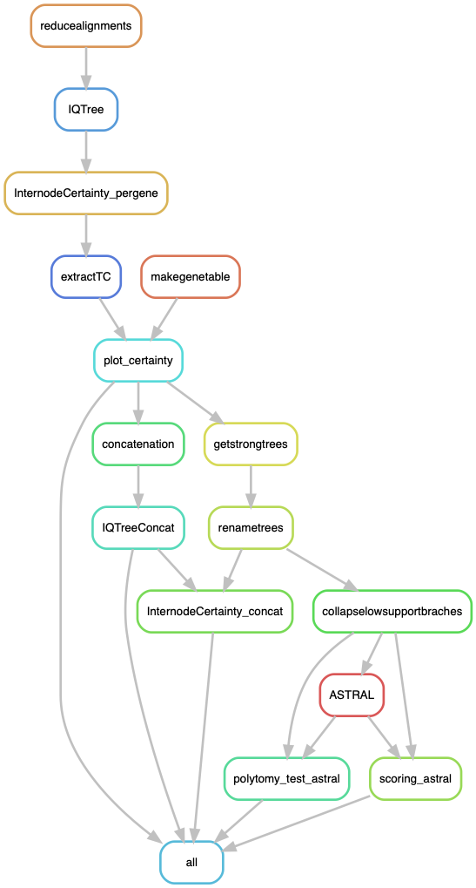

# TreeCertainty: Exploring the phylogenies of paralogs in the *Podospora* complex

The goal of this pipeline is to assess the levels of conflict in the ML and coalescent topologies, using a number of metrics including the Internode Certainty (IC), Tree Certainty (TC) ([Kobert et al. 2016 Mol. Biol. Evol. 33(6):1606–1617](https://www.ncbi.nlm.nih.gov/pmc/articles/PMC4868120/)), a polytomy test, and the effect of using different degrees of phylogenetic signal in the individual genes. It relies on the output of the pipeline `OrthoTrees.smk`. Specifically, it requites:

- The path to all the alignments of the orthogroups
- The path to the corresponding IQTree trees of each orthogroup in individual files
- `Podan2_1n.clean.txt` -- The name of the Podan2 genes for each orthogroup, in the format Pa_X_XXXX, where X is the chromosome and XXXX is the gene code.

It also requires a plotting script called `TreeCertainty.R`.

## Building the environment

First, I can start by updating conda.

    $ conda update -n base conda

Now, to create the environment.

    $ conda create -n LorePhylogenetics -c bioconda

**IMPORTANT!!** activate the environment before installing stuff! 
    
    $ conda activate LorePhylogenetics
    $ conda install -c bioconda snakemake-minimal=5.4.4
    $ conda install -c bioconda biopython=1.72=py37h04863e7_0
    $ conda install -c bioconda gffutils=0.9=py_1
    $ conda install -c bioconda mafft=7.407=1
    $ conda install -c bioconda iqtree=1.6.8
    $ conda install -c bioconda newick_utils=1.6
    $ conda install -c bioconda raxml=8.2.12
    $ conda install -c etetoolkit ete3=3.1.1

In order to plot the certainty metrics, I made a small little R environment for the R script. But I still installed R in the main environment.

    $ conda install -c r r-base=3.6.2

    $ cat envs/TCplot.yaml
```yaml
channels:
  - bioconda
  - defaults
  - conda-forge
  - r
dependencies:
  - r-dplyr=0.8.3
  - r-tidyverse=1.2.1 # It comes with ggplot 3.0.0
  - r-cowplot=1.0.0
  - r-reshape2=1.4.3
```

ASTRAL is not in conda, so I downloaded the program from the [ASTRAL GitHub](https://github.com/smirarab/ASTRAL) and copied locally (along with its lib folder):

    $ ls bin/
    astral.5.7.3.jar  lib

In the configuration file just provide the path to the jar.

## Run pipeline in Johannesson's server

First, to get an idea of how the pipeline looks like we can make a rulegraph:
    
    <!-- $ conda install -c pkgs/main graphviz=2.40.1 -->
    $ snakemake --snakefile TreeCertainty.smk --configfile TreeCertainty_config.yaml --rulegraph | dot -Tpng > rulegraph.png



Run the pipeline:

    $ screen -R TC
    $ conda activate LorePhylogenetics
    $ snakemake --snakefile TreeCertainty.smk --configfile TreeCertainty_config.yaml -p -j 35 --keep-going --use-conda &> TreeCertainty.log &


