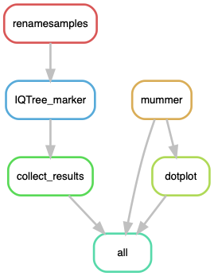

# PhyloHets

Making phylogenies of the het genes to detect ancestral polymorphism

All alignments should be in the folder `data`. There there is also another folder called `dotplots` with annotation files for the Dot plots.

## Building the environment

First, I can start by updating conda.

    $ conda update -n base conda

I can use the previously made environment `LorePhylogenetics`:

    $ conda create -n LorePhylogenetics -c bioconda

    $ conda activate LorePhylogenetics
    $ conda install -c bioconda snakemake-minimal=5.4.4
    $ conda install -c bioconda biopython=1.72=py37h04863e7_0
    $ conda install -c bioconda gffutils=0.9=py_1
    $ conda install -c bioconda mafft=7.407=1
    $ conda install -c bioconda trimal=1.4.1 
    $ conda install -c bioconda iqtree=1.6.8

And I added:
    
    $ conda install -c etetoolkit ete3=3.1.1
    $ conda install -c bioconda mummer4=4.0.0beta2 

In order to get a pretty Dotplot from the mummer alignment, I used a little R script with its own environment:

    $ cat envs/dotplot.yaml
```yaml
channels:
  - bioconda
  - defaults
  - conda-forge
  - r
dependencies:
  - r-dplyr=0.8.3
  - r-tidyverse=1.2.1 # It comes with ggplot 3.0.0
  - r-cowplot=1.0.0
```

## Run pipeline in Johannesson's server

First, to get an idea of how the pipeline looks like we can make a rulegraph:
    
    $ conda install -c pkgs/main graphviz=2.40.1 # already there
    $ snakemake --snakefile PhyloHets.smk --configfile PhyloHets_config.yaml --rulegraph | dot -Tpng > rulegraph.png



For testing without running the pipeline:

    $ snakemake --snakefile PhyloHets.smk --configfile PhyloHets_config.yaml -pn

Run the pipeline:

    $ screen -R phylo
    $ conda activate LorePhylogenetics
    $ snakemake --snakefile PhyloHets.smk --configfile PhyloHets_config.yaml -p -j 40 --keep-going --use-conda &> PhyloHets.log &
    [1] 47667
